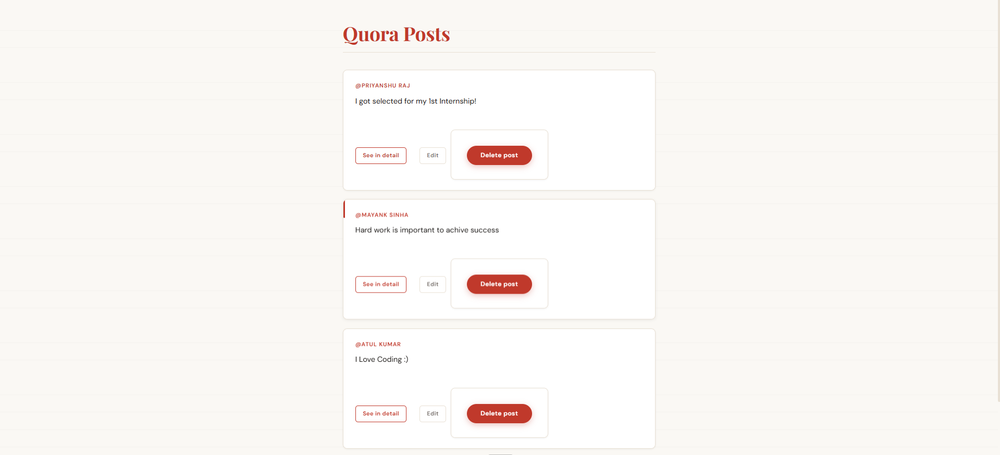
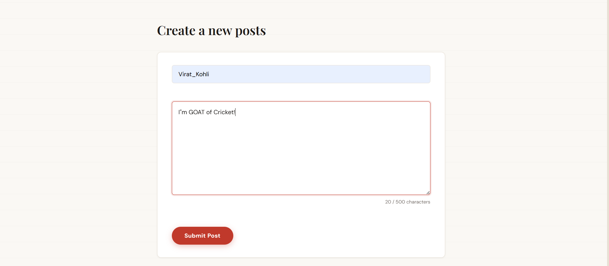
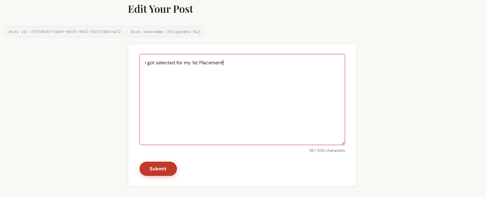
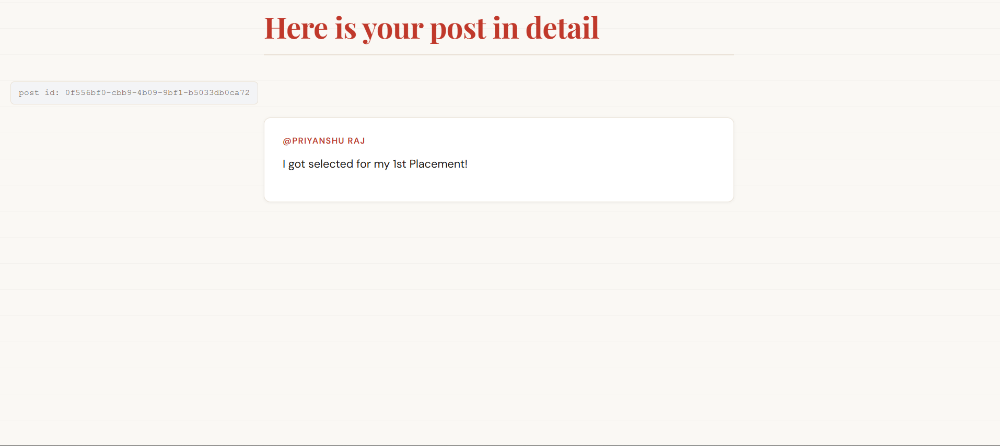

<div align="center">

# 🪶 Quill Posts

### *A Quora-inspired full-stack post board built with Node.js, Express & EJS*

[](https://nodejs.org/)
[](https://expressjs.com/)
[](https://ejs.co/)
[](LICENSE)
[]()

<br/>

> **Quill Posts** is a clean, minimal RESTful web application where users can create, read, update, and delete posts — built entirely with a Node.js + Express backend and server-side rendered EJS templates. Inspired by the simplicity of Quora.

<br/>

[🚀 View Live](#) &nbsp;·&nbsp; [🐛 Report Bug](https://github.com/priyanshu-Raj26/Quill-posts/issues) &nbsp;·&nbsp; [✨ Request Feature](https://github.com/priyanshu-Raj26/Quill-posts/issues)

</div>

---

## 📌 Table of Contents

- [✨ Features](#-features)
- [🛠️ Tech Stack](#️-tech-stack)
- [📸 Screenshots](#-screenshots)
- [⚙️ Installation & Setup](#️-installation--setup)
- [📁 Project Structure](#-project-structure)
- [🔗 API Endpoints](#-api-endpoints)
- [🚀 Future Improvements](#-future-improvements)
- [👤 Author](#-author)

---

## ✨ Features

- 📋 **View All Posts** — Browse all user-created posts on a clean card-based feed
- ✍️ **Create a Post** — Add a new post with your username and content
- 🔍 **View Post Detail** — Read a single post in a focused, distraction-free view
- ✏️ **Edit a Post** — Modify the content of any existing post
- 🗑️ **Delete a Post** — Remove a post with a two-click confirmation (no accidental deletes!)
- 🔑 **UUID-based IDs** — Every post is assigned a unique, collision-proof identifier
- 🌐 **RESTful Routing** — Clean, semantic HTTP routes following REST conventions
- 📱 **Fully Responsive** — Works beautifully on desktop, tablet, and mobile
- 🎨 **Editorial UI** — Minimal Quora-inspired design with smooth animations

---

## 🛠️ Tech Stack

| Layer | Technology |
|---|---|
| **Runtime** | Node.js |
| **Framework** | Express.js |
| **Templating** | EJS (Embedded JavaScript) |
| **Routing** | RESTful API with `method-override` |
| **ID Generation** | `uuid` (v4) |
| **Styling** | Custom CSS (Flexbox + Media Queries) |
| **Font** | Playfair Display + DM Sans (Google Fonts) |

---

## 📸 Screenshots

### 🏠 Home Page — All Posts Feed

> Displays all posts as responsive cards with Edit, View, and Delete actions.



---

### ➕ Create Post Page

> A clean, minimal form for writing and submitting a new post.



---

### ✏️ Edit Post Page

> Pre-filled form that lets users update their existing post content.



---

### 🔎 Show Post Page — Detail View

> A focused single-post view showing the full content and unique post ID.



---

## ⚙️ Installation & Setup

### Prerequisites

Make sure you have the following installed:

- [Node.js](https://nodejs.org/) `v16+`
- [npm](https://www.npmjs.com/) `v8+`

### Steps

```bash
# 1. Clone the repository
git clone https://github.com/priyanshu-Raj26/Quill-posts.git

# 2. Navigate into the project directory
cd Quill-posts

# 3. Install dependencies
npm install

# 4. Start the development server
node index.js
```

Then open your browser and visit:

```
http://localhost:3000/posts
```

---

## 📁 Project Structure

```
Quill-posts/
│
├── public/                   # Static assets served to the client
│   ├── CSS/
│   │   └── style.css         # Main stylesheet (editorial theme)
│   └── JS/
│       └── script.js         # UI enhancements & interactions
│
├── views/                    # EJS template files (server-rendered HTML)
│   ├── index.ejs             # Home page — all posts feed
│   ├── show.ejs              # Single post detail view
│   ├── new.ejs               # Create new post form
│   └── edit.ejs              # Edit existing post form
│
├── screenshots/              # App screenshots for README
│   ├── home.png
│   ├── create.png
│   ├── edit.png
│   └── show.png
│
├── index.js                  # Main Express app — routes & server
├── package.json
└── README.md
```

---

## 🔗 API Endpoints

| Method | Route | Description |
|---|---|---|
| `GET` | `/posts` | Fetch and display all posts |
| `GET` | `/posts/new` | Render the create post form |
| `POST` | `/posts` | Submit and save a new post |
| `GET` | `/posts/:id` | Display a single post by ID |
| `GET` | `/posts/:id/edit` | Render the edit form for a post |
| `PATCH` | `/posts/:id` | Update content of an existing post |
| `DELETE` | `/posts/:id` | Delete a post by ID |

> **Note:** `PATCH` and `DELETE` are simulated via `method-override` since HTML forms only support `GET` and `POST`.

---

## 🚀 Future Improvements

- [ ] 🗄️ **Database Integration** — Replace in-memory array with MongoDB or PostgreSQL
- [ ] 🔐 **User Authentication** — Sign up / login system with sessions or JWT
- [ ] ❤️ **Like / Upvote System** — Let users upvote posts (just like Quora!)
- [ ] 💬 **Comments** — Threaded comment support on each post
- [ ] 🔍 **Search & Filter** — Search posts by username or keyword
- [ ] 🌙 **Dark Mode** — Theme toggle for light/dark UI
- [ ] ☁️ **Cloud Deployment** — Deploy on Railway, Render, or Vercel

---

## 👤 Author

<div align="center">

**Priyanshu Raj**

[](https://github.com/priyanshu-Raj26)

*Built with ☕ and a lot of `console.log()` debugging.*

</div>

---

<div align="center">

⭐ **If you found this project helpful, please consider giving it a star!** ⭐

```
git clone https://github.com/priyanshu-Raj26/Quill-posts.git
```

</div>
